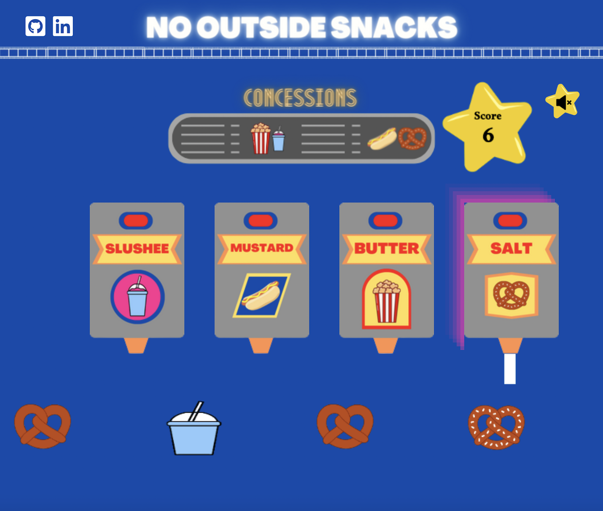

# No Outside Snacks

Play the game here! [https://katiehan22.github.io/NoOutsideSnacks/](https://katiehan22.github.io/NoOutsideSnacks/)

## Background
No Outside Snacks is a movie theater concession stand themed game built with Javascript and Canvas. Food orders will move across the bottom of the screen. The player must match the correct topping with the food item to earn enough points to move on to the next level. The player advances through 4 levels with the food items progressively moving faster and the orders getting larger. 

## Functionality and MVPs
Players are able to: 
* Control which topping dispenser use by hovering with the mouse.
* Dispense the topping onto the food item with a click. The food image will change to indicate whether or not the player was correcrt and earned a point. 
* Keep track of their score and earn enough points to advance through the 4 levels.

Additional Features:
* Music: Background music and sound effects based on different actions, with a mute button. 

## Technologies, Libraries, APIs
This project will be implemented with the following technologies: 
* The Canvas API to render the game board.
* Webpack to bundle and transpile the source Javascript code.
* npm to manage project dependencies.

## Implementation Timeline
* Friday and Weekend
  * Set up the project and get webpack running. Get familiar with the Canvas API and get the board on the screen. Create Game, Moving Object, Food Item, and Topping Dispenser classes. 
* Monday
  * Implement the logic for the game - making sure the correct food item is under the correct topping dispenser. 
* Tuesday
  * Implement harder levels.
* Wednesday
  * Focus on styling, animation, and sound effects.
* Thursday Morning
  * Deploy to GitHub pages.

## Game Screenshot
